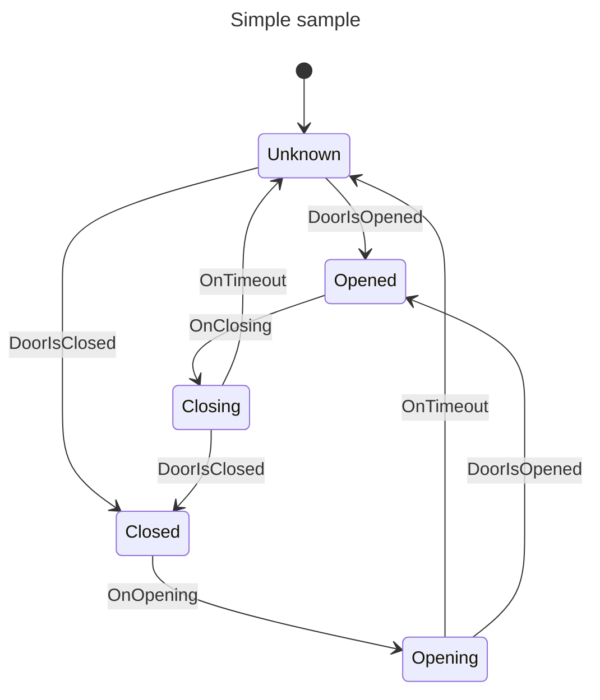

# cnc_pneumatic
A simple pneumatic door controller

This simple project is for my CNC which now has a pneumatic door (operated by pneumatic cylinders) and a pneumatic valve.
The valve is a 5/3 solenoid with an exhaust center.
This means than the solenoid takes 2 inputs:
- To push the cylinder
- To pull the cylinder
- If both are on - nothing happend
- When both are off - the pressure drops in the cylinder which can be freely moved (manual door opening/closing)

A pair of microswitch/proximity sensor detect when the door is fully opened and fully closed.

The intention is to use an ATTiny microcontroller.

The firwmware will be using a simple reactor (no RTOS) and a C++ template based state machine.

It will be coded in C++2017 using the avr-gcc compiler.

## Draft notes:

### States
The state machine should have the following states:

- Initial
  - From boot
- Unknown
  - Door is in the air (not in closed nor fully opened position)
- Opened
  - The door is resting in the opened position. From there, it can only be closed
- Closed
  - The door is resting fully closed.
- Opening
  - The solenoid 'push' is on, and the cylinder is expected to push the door open
- Closing
  - The 'pull' solenoid is on and the cylinder is expected to pull the door closed

### Events (transitions)

- OnOpen
  - The filtered open signal goes from low to high
- OnClose
  - The open signal goes from high to low
- DoorIsUp : Upper door sensor (filtered) goes high (from low)
- DoorIsDown : Lower door sensor goes high (from low)
- Timeout : A valid timer has expired

### Actions (thing to do in states or transition)

- Push : Turn on the solenoid valve controlling the push motion of the cylinder
- Pull : Turn on the solenoid valve controlling the pull motion of the cylinder
- StartTimer : Start the timer which limits to time to wait for a cycle completion (open/close)
- ResetTimer : Invalidate any ongoing timer so when the timer expires, it does nothing
- Release : Turn off the solenoid valve (push and pull)

**Note:** Since the operation is managed by a reactor, there are no race conditions.

